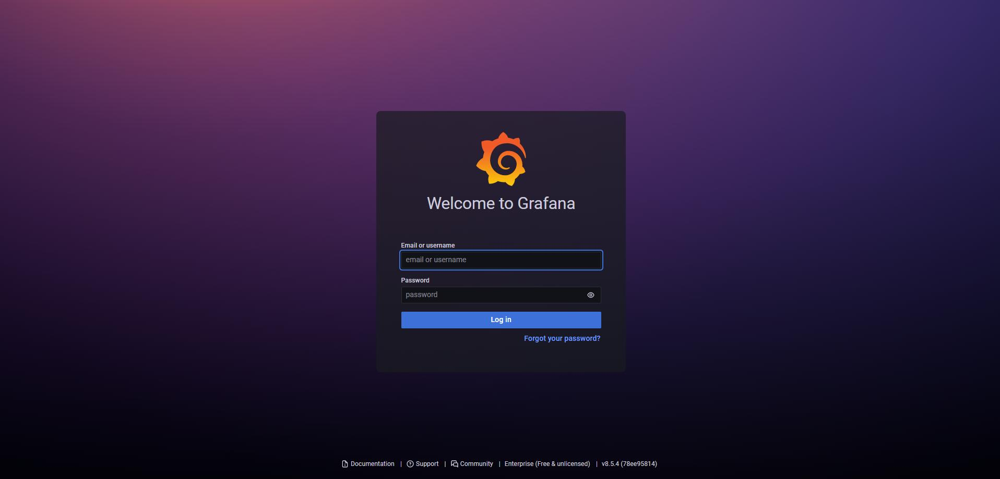
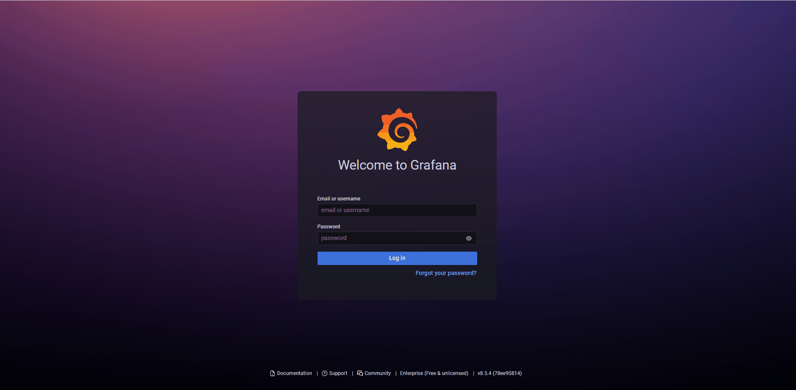
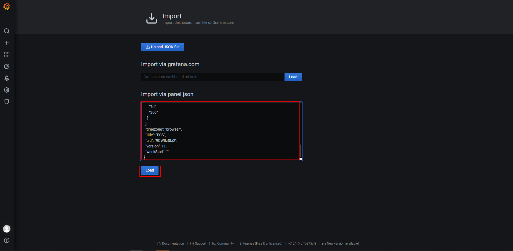
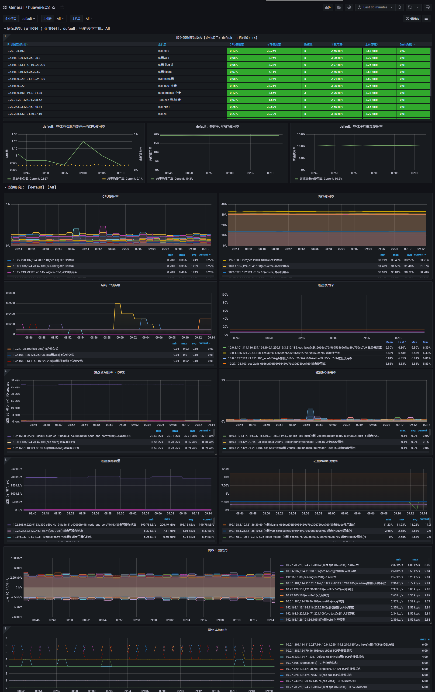

# Grafana监控面板使用
1. 下载Grafana (https://grafana.com/grafana/download)
   ```
   wget https://dl.grafana.com/enterprise/release/grafana-enterprise-9.0.5-1.x86_64.rpm
   sudo yum install grafana-enterprise-9.0.5-1.x86_64.rpm
   service grafana-server start
   ```
2. Grafana接入Prometheus数据源
   >(1) 登录Grafana
   >> 浏览器访问http://127.0.0.1:3000，登录
   >> 
   
   >(2) 配置Prometheus数据源
   >> Configuration—》Data source—》Add data source —》Prometheus —》填写Prometheus地址 —》保存&测试
   >> 
3. 配置相关云服务监控视图
   ><font size=6>+</font> —》Import —》输入json模板文件—》load
   >> 
   >> 
   
   模板文件获取地址: 
   + [云搜索服务 CSS](templates/css(es)_dashboard_template.json)
   + [云专线 DCAAS](templates/dcaas_dashboard_template.json)
   + [分布式缓存服务 DCS](templates/dcs_dashboard_template.json)
   + [弹性云服务器 ECS](templates/ecs_dashboard_template.json)
   + [弹性负载均衡 ELB](templates/elb_dashboard_template.json)
   + [关系型数据库 RDS](templates/rds_dashboard_template.json)
   + [Web应用防火墙 WAF](templates/waf_dashboard_template.json)
   + [弹性公网IP和带宽 VPC](templates/vpc_dashboard_template.json)
4. 效果展示：
   >ECS:
   > 
   